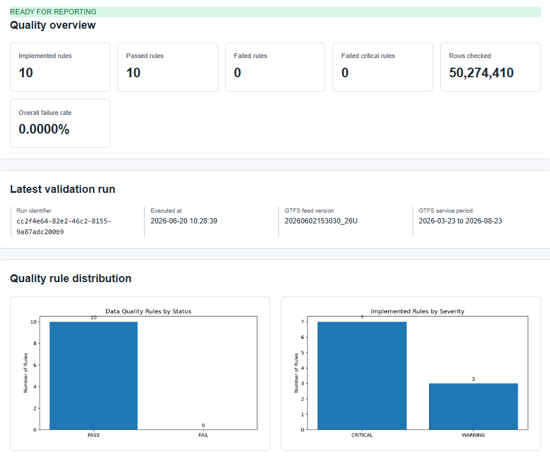
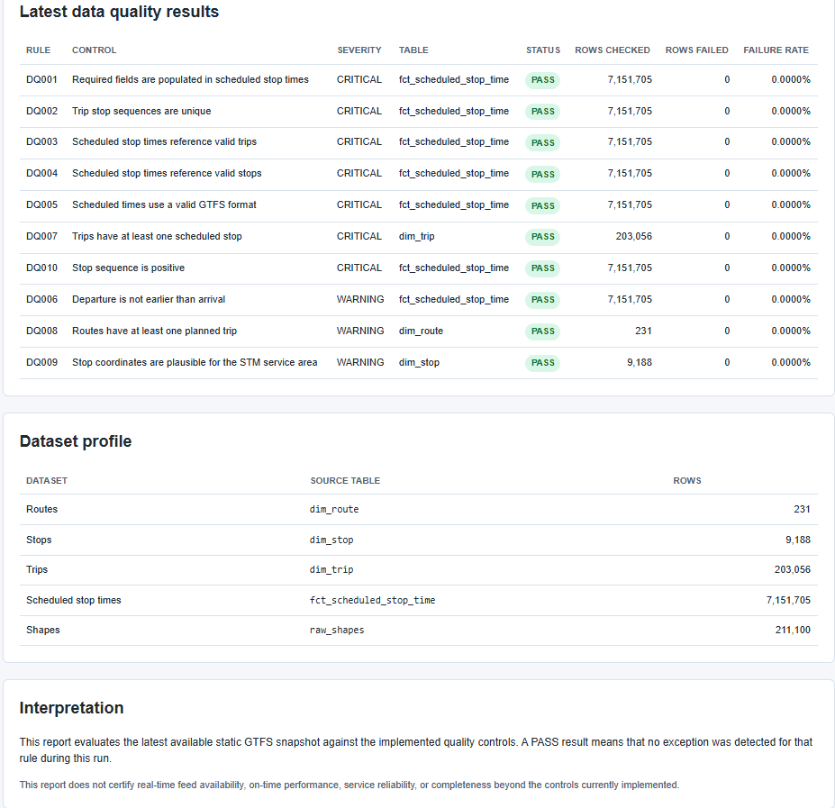

# Montréal Transit Reliability & Data Quality


[](https://github.com/franc225/montrealtransit/actions/workflows/validate.yml)
[](https://franc225.github.io/montrealtransit/)


A data quality and operational analytics project built from Montréal STM GTFS data.

[View the live Data Quality Overview](https://franc225.github.io/montrealtransit/)

## Objective

Transform static STM GTFS data into a reliable analytical dataset, validate its quality through repeatable controls, and publish a static HTML data quality report.

This project demonstrates practical skills in:

- Python data ingestion
- DuckDB data warehousing
- Operational data modelling
- SQL-based data quality checks
- Static HTML reporting with Matplotlib
- Data documentation and governance
- Reproducible analytics workflows

## Current progress

### Completed

- Downloaded and extracted the STM static GTFS feed.
- Loaded GTFS source files into DuckDB raw tables.
- Built analytical tables for routes, stops, services, trips, and scheduled stop times.
- Implemented 10 data quality rules.
- Stored data quality runs and results in DuckDB.
- Validated the first GTFS snapshot successfully.
- Generated a static HTML **Data Quality Overview** report.
- Created data model and data quality rule documentation.
- Automated the static GTFS refresh and report regeneration process.

### Planned

- Capture GTFS-Realtime data over several days.
- Compare scheduled and real-time service performance.
- Measure feed freshness and completeness.
- Add service reliability metrics and dashboards.
- Add delay prediction or anomaly detection only after the reliability layer is complete.

## Initial data profile

| Dataset | Rows |
|---|---:|
| Routes | 231 |
| Stops | 9,188 |
| Trips | 203,056 |
| Scheduled stop times | 7,151,705 |
| Shapes | 211,100 |

## Architecture

```text
STM static GTFS ZIP
        |
        v
Python refresh and ingestion
        |
        v
DuckDB raw tables
        |
        v
Analytical model
(dim_route, dim_stop, dim_service, dim_trip, fct_scheduled_stop_time)
        |
        v
Data quality checks
        |
        v
dq_rule / dq_run / dq_result
        |
        v
Static HTML Data Quality Overview
        |
        v
GitHub Pages
```

## Data Quality Overview

The project generates a static HTML report published through GitHub Pages.

[View the live report](https://franc225.github.io/montrealtransit/)

The local HTML report is generated at:

```text
docs/index.html
```

The report includes:

- overall readiness assessment;
- number of implemented, passed, and failed rules;
- total rows checked and overall failure rate;
- latest validation run metadata;
- charts for rule status and severity;
- detailed results for every quality rule;
- dataset profile and row counts.

## Report preview

### Data Quality Overview



### Data Quality Rule Results



## Data model

The project separates the data warehouse into three layers.

| Layer | Purpose | Examples |
|---|---|---|
| Raw | Preserve GTFS source files as loaded | `raw_routes`, `raw_stops`, `raw_trips`, `raw_stop_times` |
| Analytical | Provide typed tables for reporting and validation | `dim_route`, `dim_stop`, `dim_trip`, `fct_scheduled_stop_time` |
| Quality | Store rules, runs, and validation results | `dq_rule`, `dq_run`, `dq_result` |

Detailed documentation is available in [data_model.md](docs/data_model.md).

### Raw tables

The ingestion process loads GTFS text files into raw DuckDB tables, including:

- `raw_agency`
- `raw_calendar`
- `raw_calendar_dates`
- `raw_feed_info`
- `raw_routes`
- `raw_shapes`
- `raw_stop_times`
- `raw_stops`
- `raw_trips`

### Analytical tables

| Table | Description |
|---|---|
| `dim_route` | STM routes and route attributes |
| `dim_stop` | Stops and geographic coordinates |
| `dim_service` | GTFS service calendars |
| `dim_trip` | Planned trips by route and service |
| `fct_scheduled_stop_time` | Scheduled arrival and departure times by stop |
| `meta_gtfs_feed` | GTFS feed metadata and ingestion information |

### Data quality tables

| Table | Description |
|---|---|
| `dq_rule` | Quality rule catalogue |
| `dq_run` | Quality check execution history |
| `dq_result` | Quality rule results by execution |

## Implemented data quality controls

| Rule | Severity | Control |
|---|---|---|
| DQ001 | CRITICAL | Required fields are populated in scheduled stop times |
| DQ002 | CRITICAL | Trip stop sequences are unique |
| DQ003 | CRITICAL | Scheduled stop times reference valid trips |
| DQ004 | CRITICAL | Scheduled stop times reference valid stops |
| DQ005 | CRITICAL | Scheduled times use a valid GTFS format |
| DQ006 | WARNING | Departure is not earlier than arrival |
| DQ007 | CRITICAL | Trips have at least one scheduled stop |
| DQ008 | WARNING | Routes have at least one planned trip |
| DQ009 | WARNING | Stop coordinates are plausible for the STM service area |
| DQ010 | CRITICAL | Stop sequence is positive |

Detailed documentation is available in [data_quality_rules.md](docs/data_quality_rules.md).

## Initial quality results

The first executed GTFS snapshot passed all 10 implemented data quality controls.

The controls cover:

- completeness;
- duplicate prevention;
- referential integrity;
- temporal consistency;
- sequence validity;
- geographic plausibility;
- structural validity of the GTFS feed.

A successful validation means that no exception was detected by the current rules. It does not certify real-time data availability, punctuality, service reliability, or operational performance.

## Refresh static GTFS data

The project uses the current STM static GTFS feed for schedules, stops, routes, trips, service calendars, and shapes.

The GTFS source is available from:

- [STM Developers - GTFS scheduled data](https://www.stm.info/fr/a-propos/developpeurs)
- [Montréal Open Data - STM planned schedules and routes](https://donnees.montreal.ca/en/dataset/stm-horaires-planifies-et-trajets-des-bus-et-du-metro)

The refresh workflow downloads the current GTFS archive, validates its structure, replaces the local source files, rebuilds the DuckDB warehouse, runs the data quality checks, and regenerates the HTML report.

### Refresh the complete pipeline

Activate the local Python environment:

```powershell
.\.venv\Scripts\Activate.ps1
```

Run the full refresh and open the updated report:

```powershell
python .\src\refresh_static_gtfs.py --open-report
```

The refresh script performs the following steps:

```text
Download current STM GTFS ZIP
        |
        v
Validate ZIP integrity and required GTFS files
        |
        v
Archive the downloaded GTFS snapshot locally
        |
        v
Replace data/raw/gtfs/current
        |
        v
Run ingest_gtfs.py
        |
        v
Run run_quality_checks.py
        |
        v
Run generate_quality_report.py
        |
        v
Update docs/index.html and report charts
```

The script updates these local files:

```text
data/raw/gtfs/current/
data/warehouse/montreal_transit.duckdb
docs/index.html
docs/assets/rules_by_status.png
docs/assets/rules_by_severity.png
```

Downloaded GTFS ZIP snapshots are stored under:

```text
data/archive/gtfs/
```

The archived GTFS files, extracted source files, and DuckDB database are intentionally excluded from Git.

### Publish the refreshed report

After validating the report locally, commit the updated HTML report and chart images:

```powershell
git add docs
git commit -m "data: refresh STM GTFS snapshot and quality report"
git push
```

GitHub Pages will publish the updated report automatically.

### If the STM changes the download URL

Check the STM Developers page or the Montréal Open Data dataset page for the new static GTFS link.

Then run:

```powershell
python .\src\refresh_static_gtfs.py --download-url "https://new-stm-download-url/gtfs_stm.zip" --open-report
```

### Optional shapefile data

The `stm_sig.zip` file is not required for the current data quality pipeline.

It can be used later for geographic analysis, mapping, or route visualization.

## Project structure

```text
montrealtransit/
├── data/
│   ├── archive/                     # Ignored: downloaded GTFS snapshots
│   ├── raw/                         # Ignored: extracted GTFS files
│   └── warehouse/                   # Ignored: local DuckDB database
├── docs/
│   ├── assets/
│   │   ├── screenshots/
│   │   │   ├── data-quality-overview.png
│   │   │   └── data-quality-rule-results.png
│   │   ├── rules_by_severity.png
│   │   └── rules_by_status.png
│   ├── .nojekyll
│   ├── data_model.md
│   ├── data_quality_rules.md
│   └── index.html
├── sql/
│   └── quality/
├── src/
│   ├── generate_quality_report.py
│   ├── ingest_gtfs.py
│   ├── refresh_static_gtfs.py
│   └── run_quality_checks.py
├── .gitignore
├── README.md
└── requirements.txt
```

## Local setup

```powershell
python -m venv .venv
.\.venv\Scripts\Activate.ps1

python -m pip install -r requirements.txt
```

## Run the pipeline manually

The recommended approach is the automated refresh script. The commands below are useful when running an existing local GTFS snapshot manually.

```powershell
python .\src\ingest_gtfs.py
python .\src\run_quality_checks.py
python .\src\generate_quality_report.py
```

## Local report preview

```powershell
Start-Process .\docs\index.html
```

## Continuous integration

GitHub Actions validates the Python pipeline on every relevant push and pull request.

The workflow:

- installs the pinned Python dependencies;
- compiles the Python scripts;
- validates the refresh script command-line interface;
- runs the ingestion, quality checks, and HTML report generation against a synthetic GTFS fixture;
- confirms that a valid fixture passes all 10 rules;
- confirms that an intentionally invalid stop sequence is detected by `DQ010`.

The CI workflow does not download the live STM GTFS feed. This keeps validation deterministic, fast, and independent of external service availability.

Run the same tests locally:

```powershell
python -m unittest discover -s tests -p "test_*.py" -v
```

## Data source

Static GTFS data supplied by the Société de transport de Montréal (STM).

## Roadmap

### Version 1 — Data Quality Foundation

- [x] Download static GTFS data
- [x] Build DuckDB ingestion
- [x] Create analytical model
- [x] Implement 10 quality checks
- [x] Generate static HTML Data Quality Overview
- [x] Document the data model and quality rules
- [x] Automate static GTFS refresh and report generation

### Version 2 — Service Reliability

- [ ] Capture GTFS-Realtime data
- [ ] Measure feed freshness and completeness
- [ ] Compare scheduled and real-time service data
- [ ] Build service reliability indicators

### Version 3 — Advanced Analytics

- [ ] Delay prediction
- [ ] Anomaly detection
- [ ] Reliability trends by route, period, and direction