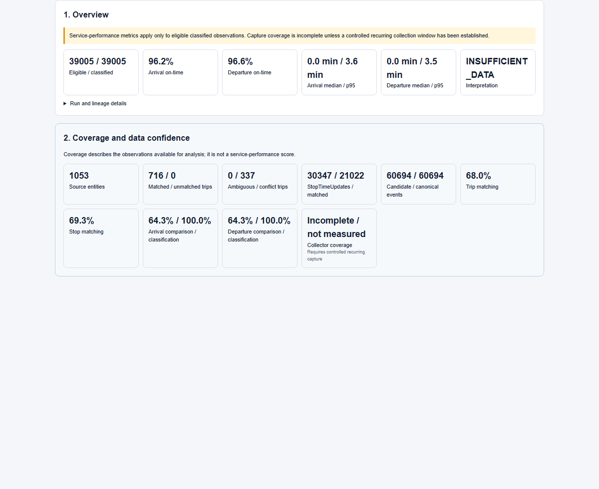
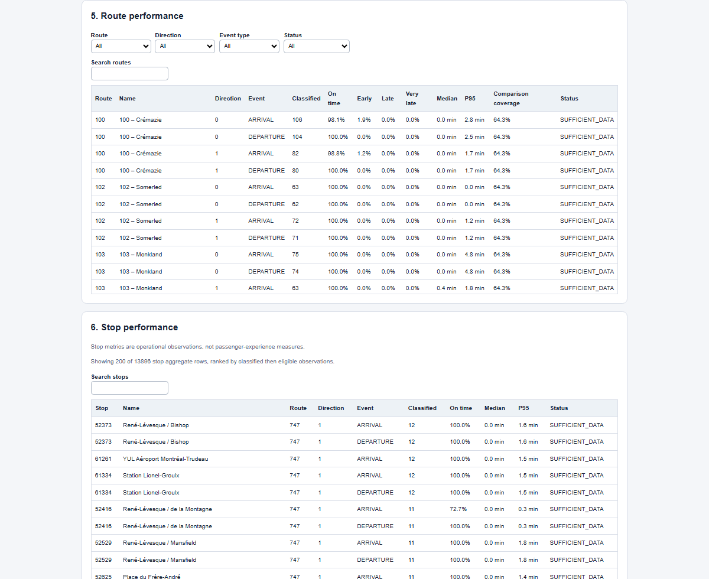

# Montréal Transit Reliability & Data Quality


[](https://github.com/franc225/montrealtransit/actions/workflows/validate.yml)
[](https://franc225.github.io/montrealtransit/)

A reproducible Python and DuckDB portfolio project that validates Montréal STM
schedule data, preserves and analyzes GTFS-Realtime observations, compares
observed service with the schedule, and publishes static quality and reliability
reports.

[Data Quality Overview](https://franc225.github.io/montrealtransit/) ·
[GTFS-Realtime Reliability Dashboard](https://franc225.github.io/montrealtransit/gtfs_realtime_reliability.html)

## Release status

`v1.0.0` is the completed portfolio release. It demonstrates an end-to-end,
traceable analytics workflow using a controlled set of STM observations. It is
not a continuously operated monitoring service, an official STM product, or a
complete assessment of system-wide performance.

## Key capabilities

- **Static GTFS:** validated download and archival, raw ingestion, typed
  analytical tables, ten quality rules, traceable validation runs, and a static
  quality report.
- **Secure realtime capture:** environment-only API credentials, redirect
  rejection, bounded streaming, unchanged protobuf preservation, incremental
  SHA-256, atomic payload/metadata writes, and network-free dry runs.
- **Realtime analytics:** integrity-checked protobuf parsing, normalized DuckDB
  persistence, feed freshness and completeness checks, deterministic schedule
  matching, and explicit lineage across every stage.
- **Reliability indicators:** separate arrival and departure classifications,
  delay distributions, route/stop/trip aggregates, cancellations, and coverage
  measures under a versioned project policy.
- **Reporting and validation:** self-contained HTML dashboards, bounded public
  aggregate data, synthetic integration tests, network tripwires, and GitHub
  Actions validation on Windows-compatible Python 3.11 code.

## Architecture

```text
STM static GTFS ZIP                    STM GTFS-Realtime API
        |                                       |
        v                                       v
Validate, archive, ingest              Secure one-shot raw capture
        |                              (.pb + nonsecret metadata)
        v                                       |
Raw + analytical DuckDB tables                  v
        |                              Integrity validation + parsing
        v                                       |
Quality rules and traceable runs                 v
        |                              Normalized DuckDB persistence
        |                                       |
        +--------------------+------------------+
                             v
                 Scheduled-service matching
                             |
                             v
                Reliability + coverage facts
                    |                  |
                    v                  v
          Data quality report   Reliability dashboard
                    \                  /
                     +--- GitHub Pages
```

Static and realtime raw data remain separate. The realtime workflow uses a
specific ingested static snapshot only when matching observations to scheduled
service.

## Technology stack

- Python 3.11 and standard-library networking
- DuckDB for raw, analytical, quality, matching, and reliability persistence
- Official GTFS-Realtime Protocol Buffer bindings
- Matplotlib for static quality-report charts
- Self-contained HTML, CSS, and JavaScript for interactive reporting
- `unittest` synthetic fixtures and GitHub Actions continuous integration

## Published dashboards

### Static data quality

The [Data Quality Overview](https://franc225.github.io/montrealtransit/) reports
readiness, validation lineage, all ten rule results, severity/status charts, and
dataset row counts.


### GTFS-Realtime reliability

The [Reliability Dashboard](https://franc225.github.io/montrealtransit/gtfs_realtime_reliability.html)
separates service-performance indicators from data coverage and includes
lineage, punctuality, delay distribution, route/stop aggregates, trip detail,
and methodology. Public tables use deterministic bounded subsets; detailed
event facts remain in DuckDB.





Regenerate screenshots from the actual HTML artifacts with an installed Edge,
Chrome, or Chromium browser:

```powershell
python .\src\generate_report_screenshots.py
```

Use `--report static` or `--report realtime` to limit generation to one report.

## Data integrity and security

- `MONTREAL_TRANSIT_PROJECT_ROOT` isolates integration tests in temporary
  project roots and prevents changes to the developer's local warehouse.
- The STM key is read only from `STM_GTFS_REALTIME_API_KEY`; it is excluded from
  representations, exceptions, logs, metadata, reports, and test output.
- Capture permits one HTTPS GET to the configured STM endpoint and rejects
  redirects, preventing credential forwarding to another destination.
- Responses are streamed with pre-read and in-stream size enforcement. Stored
  bytes are hashed incrementally and finalized with metadata as an atomic,
  non-overwriting logical pair.
- Parsing verifies metadata, byte count, and SHA-256 before protobuf decoding.
- Persistence is transactional, additive, idempotent, and versioned. Matching
  requires complete lineage and never selects an ambiguous candidate.
- Undefined denominators remain null/`NOT_APPLICABLE`; missing or unmatched
  realtime data is never interpreted as a service failure.
- Automated tests use synthetic fixtures and network tripwires. CI never needs
  an STM API key, live feed, local DuckDB database, or GitHub Pages availability.

Raw downloads, captured protobuf, local DuckDB files, credentials, and caches
are ignored by Git. Generated public reports and curated screenshots are
versioned intentionally.

## Local setup

```powershell
python -m venv .venv
.\.venv\Scripts\Activate.ps1
python -m pip install -r requirements.txt
```

The optional project-root override is useful for isolated workspaces:

```powershell
$env:MONTREAL_TRANSIT_PROJECT_ROOT = "C:\path\to\isolated\workspace"
```

## Static GTFS workflow

Refresh the static feed, rebuild the warehouse, execute quality checks, and
regenerate the report:

```powershell
python .\src\refresh_static_gtfs.py --open-report
```

The refresh script downloads and validates the current archive, preserves its
SHA-256 and metadata, replaces the local extracted snapshot, runs ingestion and
quality checks with one explicit `run_id`, generates `docs/index.html`, and
verifies that the report contains that same run identifier.

Individual stages can be run against an existing local snapshot:

```powershell
python .\src\ingest_gtfs.py
python .\src\run_quality_checks.py
python .\src\generate_quality_report.py
```

## GTFS-Realtime end-to-end workflow

The following 12-step PowerShell workflow reproduces the controlled pipeline.
It requires an ingested static snapshot and an STM developer key for the two
explicit capture steps. No later stage makes a network request.

### 1. Refresh static GTFS

```powershell
python .\src\refresh_static_gtfs.py
```

### 2. Capture Vehicle Positions

Load the key for the current session without putting its value directly in
PowerShell history:

```powershell
$secureKey = Read-Host "STM API key" -AsSecureString
$keyPointer = [Runtime.InteropServices.Marshal]::SecureStringToBSTR($secureKey)
try {
    $env:STM_GTFS_REALTIME_API_KEY = [Runtime.InteropServices.Marshal]::PtrToStringBSTR($keyPointer)
}
finally {
    [Runtime.InteropServices.Marshal]::ZeroFreeBSTR($keyPointer)
}

python .\src\capture_gtfs_realtime.py --feed vehicle_positions

$vpPayload = (
    Get-ChildItem .\data\raw\gtfs_realtime\stm\vehicle_positions `
        -Recurse -Filter *.pb -File |
    Sort-Object LastWriteTimeUtc -Descending |
    Select-Object -First 1
).FullName
```

### 3. Capture Trip Updates

```powershell
python .\src\capture_gtfs_realtime.py --feed trip_updates

$tuPayload = (
    Get-ChildItem .\data\raw\gtfs_realtime\stm\trip_updates `
        -Recurse -Filter *.pb -File |
    Sort-Object LastWriteTimeUtc -Descending |
    Select-Object -First 1
).FullName
```

### 4. Ingest Vehicle Positions

```powershell
python .\src\ingest_gtfs_realtime.py --payload $vpPayload |
    Tee-Object -Variable vpIngestOutput

$vpCaptureUuid = (
    ($vpIngestOutput | Select-String '^Capture UUID:').Line `
        -replace '^Capture UUID:\s*', ''
)
```

### 5. Ingest Trip Updates

```powershell
python .\src\ingest_gtfs_realtime.py --payload $tuPayload |
    Tee-Object -Variable tuIngestOutput

$tuCaptureUuid = (
    ($tuIngestOutput | Select-String '^Capture UUID:').Line `
        -replace '^Capture UUID:\s*', ''
)
```

### 6. Match Vehicle Positions to scheduled GTFS

```powershell
python .\src\match_gtfs_realtime.py --capture-uuid $vpCaptureUuid |
    Tee-Object -Variable vpMatchOutput

$vpMatchRunId = (
    ($vpMatchOutput | Select-String '^Match run ID:').Line `
        -replace '^Match run ID:\s*', ''
)
```

### 7. Match Trip Updates

```powershell
python .\src\match_gtfs_realtime.py --capture-uuid $tuCaptureUuid |
    Tee-Object -Variable tuMatchOutput

$tuMatchRunId = (
    ($tuMatchOutput | Select-String '^Match run ID:').Line `
        -replace '^Match run ID:\s*', ''
)
```

### 8. Calculate reliability indicators

```powershell
python .\src\calculate_gtfs_realtime_reliability.py `
    --match-run-id $tuMatchRunId |
    Tee-Object -Variable reliabilityOutput

$reliabilityRunId = (
    ($reliabilityOutput | Select-String '^Reliability run ID:').Line `
        -replace '^Reliability run ID:\s*', ''
)
```

### 9. Review lineage identifiers

```powershell
[PSCustomObject]@{
    VehiclePositionsCapture  = $vpCaptureUuid
    VehiclePositionsMatchRun = $vpMatchRunId
    TripUpdatesCapture       = $tuCaptureUuid
    TripUpdatesMatchRun      = $tuMatchRunId
    ReliabilityRun           = $reliabilityRunId
}
```

### 10. Generate the interactive dashboard

```powershell
python .\src\generate_gtfs_realtime_dashboard.py `
    --reliability-run-id $reliabilityRunId `
    --profile public `
    --output .\docs\gtfs_realtime_reliability.html `
    --open
```

### 11. Verify secret handling

The expected result is no output. Do not share any matching output if a leak is
found.

```powershell
$searchRoots = @(".\src", ".\tests", ".\config", ".\docs")

Get-ChildItem $searchRoots -Recurse -File -ErrorAction SilentlyContinue |
    Select-String -SimpleMatch $env:STM_GTFS_REALTIME_API_KEY

Remove-Item Env:STM_GTFS_REALTIME_API_KEY
```

### 12. Re-run validation

```powershell
python -m compileall -q src tests
python -m unittest discover -s tests -p "test_*.py" -v
```

## Data model and quality controls

The warehouse uses raw, analytical, quality, normalized realtime, matching,
and reliability layers. Raw GTFS strings are preserved; typed conversions,
including valid times beyond `23:59:59`, belong in analytical tables.

The static quality catalogue contains ten stable rules (`DQ001`–`DQ010`)
covering required fields, uniqueness, references, time formats, temporal
ordering, trip/route coverage, coordinates, and positive stop sequences.
Realtime controls separately assess capture-relative freshness, completeness,
sequence consistency, matching coverage, comparison availability, and delay
source consistency.

See [Data Model](docs/data_model.md) and
[Data Quality Rules](docs/data_quality_rules.md) for schemas and definitions.

## Project structure

```text
montrealtransit/
├── config/                         # Nonsecret realtime policies
├── data/
│   ├── archive/                    # Ignored local GTFS snapshots
│   ├── raw/                        # Ignored static/realtime source data
│   └── warehouse/                  # Ignored local DuckDB warehouse
├── docs/
│   ├── assets/screenshots/         # Curated README previews
│   ├── index.html                  # Published static-quality report
│   ├── gtfs_realtime_reliability.html
│   └── *.md                        # Architecture and methodology guides
├── src/
│   ├── refresh_static_gtfs.py      # Static end-to-end orchestration
│   ├── ingest_gtfs.py              # Static ingestion and modelling
│   ├── run_quality_checks.py       # Static quality execution
│   ├── generate_quality_report.py  # Static report generation
│   ├── capture_gtfs_realtime.py    # Secure one-shot capture
│   ├── parse_gtfs_realtime.py      # Integrity checks and protobuf parsing
│   ├── ingest_gtfs_realtime.py     # Quality and normalized persistence
│   ├── match_gtfs_realtime.py      # Scheduled-service matching
│   ├── calculate_gtfs_realtime_reliability.py
│   └── generate_gtfs_realtime_dashboard.py
├── tests/                          # Synthetic, isolated test suite
├── .github/workflows/validate.yml
├── .env.example
├── CHANGELOG.md
├── README.md
└── requirements.txt
```

## Documentation

| Topic | Guide |
|---|---|
| Warehouse schemas | [Data Model](docs/data_model.md) |
| Quality rules and indicators | [Data Quality Rules](docs/data_quality_rules.md) |
| Configuration and storage | [GTFS-Realtime Foundation](docs/gtfs_realtime_foundation.md) |
| Secure capture | [One-Shot Capture](docs/gtfs_realtime_capture.md) |
| Parsing | [Protocol Buffer Parsing](docs/gtfs_realtime_parsing.md) |
| Persistence | [Normalized Persistence](docs/gtfs_realtime_persistence.md) |
| Freshness and completeness | [Feed Quality](docs/gtfs_realtime_feed_quality.md) |
| Schedule matching | [Scheduled-Service Matching](docs/gtfs_realtime_schedule_matching.md) |
| Reliability methodology | [Service Reliability Indicators](docs/gtfs_realtime_reliability.md) |
| Interactive reporting | [Reliability Reporting](docs/gtfs_realtime_reporting.md) |
| Attribution and licence | [Data Source and Terms](docs/data_source_and_terms.md) |
| Release history | [Changelog](CHANGELOG.md) |

## Continuous integration

GitHub Actions installs pinned dependencies, compiles `src/` and `tests/`,
checks the static refresh CLI, and runs the complete test suite on every
relevant pull request and push to `main`. Tests cover the static pipeline and
all realtime layers with temporary warehouses, synthetic protobuf messages,
mocked transport, and network tripwires.

Run the same validation locally:

```powershell
python -m compileall -q src tests
python -m unittest discover -s tests -p "test_*.py" -v
```

## Limitations and optional extensions

- The published realtime dashboard is a controlled feasibility demonstration,
  not continuous STM monitoring or a statistically representative service
  assessment.
- Collector availability, headway adherence, excess wait time, travel-time
  reliability, and passenger weighting require recurring controlled coverage
  and additional methodology.
- Frequency-based static trip instances remain unsupported until their
  persistence and matching policy are defined.
- Predictive delay and anomaly models are intentionally outside this release;
  they are reasonable future extensions only after broader observation
  coverage and monitoring are established.

## Data source and disclaimer

Data source: Société de transport de Montréal (STM). Data is used under the
applicable terms described in [Data Source, Attribution, and Terms of Use](docs/data_source_and_terms.md),
including Creative Commons Attribution 4.0 where applicable. This is an
independent and unofficial portfolio project and is not affiliated with or
endorsed by the STM. Data is provided as-is and according to availability.

---

**Release:** `v1.0.0` — first complete portfolio release, 2026-08-08.
