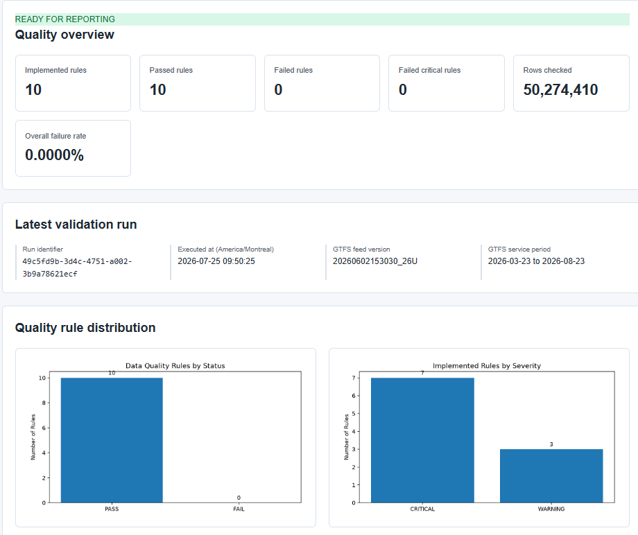
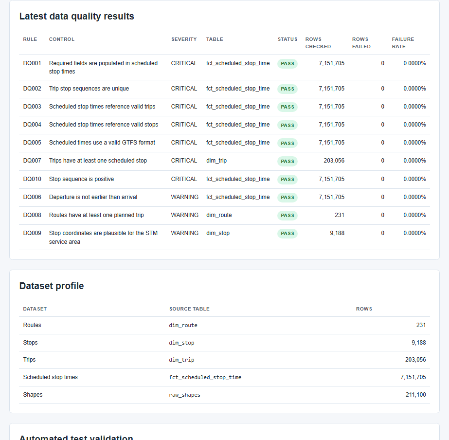

# Montréal Transit Reliability & Data Quality


[](https://github.com/franc225/montrealtransit/actions/workflows/validate.yml)
[](https://franc225.github.io/montrealtransit/)


A data quality and operational analytics project built from Montréal STM GTFS data.

[View the live Data Quality Overview](https://franc225.github.io/montrealtransit/)

## Objective

Transform static STM GTFS data into a reliable analytical dataset, validate its quality through repeatable controls, and publish a static HTML data quality report.

This project demonstrates practical skills in:

- Python data ingestion
- DuckDB data warehousing
- Operational data modelling
- SQL-based data quality checks
- Static HTML reporting with Matplotlib
- Data documentation and governance
- Reproducible analytics workflows

## Current progress

### Completed

- Downloaded and extracted the STM static GTFS feed.
- Loaded GTFS source files into DuckDB raw tables.
- Built analytical tables for routes, stops, services, trips, and scheduled stop times.
- Implemented 10 data quality rules.
- Stored data quality runs and results in DuckDB.
- Validated the first GTFS snapshot successfully.
- Generated a static HTML **Data Quality Overview** report.
- Created data model and data quality rule documentation.
- Automated the static GTFS refresh and report regeneration process.
- Established validated, nonsecret GTFS-Realtime configuration.
- Added environment-variable API key handling with secret-safe validation.
- Configured the official STM Vehicle Positions and Trip Updates endpoints.
- Validated the official `apiKey` authentication and protobuf Accept headers.
- Added strict HTTPS, STM-host, URL credential, query, fragment, and path validation.
- Defined safe, isolated raw-storage and capture filename conventions.
- Added network-free GTFS-Realtime contract, secret-safety, and path tests.
- Documented STM attribution, CC BY 4.0 terms, and unofficial-project status.
- Added secure one-shot raw capture with streamed size enforcement.
- Added atomic `.pb` payload and nonsecret JSON metadata persistence.
- Enforced exact `Content-Length` integrity when the header is present.
- Added redirect-safe transport, protocol-failure handling, and network-free
  security regression tests.
- Added one-shot capture for both Vehicle Positions and Trip Updates with
  network-free dry-run support.
- Added incremental SHA-256 generation and non-overwriting rollback-based
  payload/metadata persistence.
- Added capture-relative freshness and entity/field completeness analytics.
- Added transactional normalized GTFS-Realtime DuckDB tables with safe
  idempotent ingestion and rollback.

### Planned

- Schedule recurring capture after the one-shot collector is operationally
  validated.
- Match scheduled and real-time trip identifiers.
- Compare scheduled and real-time service performance.
- Add service reliability metrics and dashboards.
- Add delay prediction or anomaly detection only after the reliability layer is complete.

## Initial data profile

| Dataset | Rows |
|---|---:|
| Routes | 231 |
| Stops | 9,188 |
| Trips | 203,056 |
| Scheduled stop times | 7,151,705 |
| Shapes | 211,100 |

## Architecture

```text
STM static GTFS ZIP
        |
        v
Python refresh and ingestion
        |
        v
DuckDB raw tables
        |
        v
Analytical model
(dim_route, dim_stop, dim_service, dim_trip, fct_scheduled_stop_time)
        |
        v
Data quality checks
        |
        v
dq_rule / dq_run / dq_result
        |
        v
Static HTML Data Quality Overview
        |
        v
GitHub Pages
```

## Data Quality Overview

The project generates a static HTML report published through GitHub Pages.

[View the live report](https://franc225.github.io/montrealtransit/)

The local HTML report is generated at:

```text
docs/index.html
```

The report includes:

- overall readiness assessment;
- number of implemented, passed, and failed rules;
- total rows checked and overall failure rate;
- latest validation run metadata;
- charts for rule status and severity;
- detailed results for every quality rule;
- dataset profile and row counts.
- automated validation coverage across configuration, capture, parsing, and
  static-pipeline tests.

## Report preview

These images are generated from `docs/index.html`:

### Data Quality Overview



### Data Quality Rule Results



Regenerate both screenshots with an installed Microsoft Edge, Google Chrome,
or Chromium browser:

```powershell
python .\src\generate_report_screenshots.py
```

## Data model

The project separates the data warehouse into three layers.

| Layer | Purpose | Examples |
|---|---|---|
| Raw | Preserve GTFS source files as loaded | `raw_routes`, `raw_stops`, `raw_trips`, `raw_stop_times` |
| Analytical | Provide typed tables for reporting and validation | `dim_route`, `dim_stop`, `dim_trip`, `fct_scheduled_stop_time` |
| Quality | Store rules, runs, and validation results | `dq_rule`, `dq_run`, `dq_result` |

Detailed documentation is available in [data_model.md](docs/data_model.md).

### Raw tables

The ingestion process loads GTFS text files into raw DuckDB tables, including:

- `raw_agency`
- `raw_calendar`
- `raw_calendar_dates`
- `raw_feed_info`
- `raw_routes`
- `raw_shapes`
- `raw_stop_times`
- `raw_stops`
- `raw_trips`

### Analytical tables

| Table | Description |
|---|---|
| `dim_route` | STM routes and route attributes |
| `dim_stop` | Stops and geographic coordinates |
| `dim_service` | GTFS service calendars |
| `dim_trip` | Planned trips by route and service |
| `fct_scheduled_stop_time` | Scheduled arrival and departure times by stop |
| `meta_gtfs_feed` | GTFS feed metadata and ingestion information |

### Data quality tables

| Table | Description |
|---|---|
| `dq_rule` | Quality rule catalogue |
| `dq_run` | Quality check execution history |
| `dq_result` | Quality rule results by execution |

## Implemented data quality controls

| Rule | Severity | Control |
|---|---|---|
| DQ001 | CRITICAL | Required fields are populated in scheduled stop times |
| DQ002 | CRITICAL | Trip stop sequences are unique |
| DQ003 | CRITICAL | Scheduled stop times reference valid trips |
| DQ004 | CRITICAL | Scheduled stop times reference valid stops |
| DQ005 | CRITICAL | Scheduled times use valid GTFS hours and `00`–`59` minute/second components |
| DQ006 | WARNING | Departure is not earlier than arrival |
| DQ007 | CRITICAL | Trips have at least one scheduled stop |
| DQ008 | WARNING | Routes have at least one planned trip |
| DQ009 | WARNING | Stop coordinates are plausible for the STM service area |
| DQ010 | CRITICAL | Stop sequence is positive |

Detailed documentation is available in [data_quality_rules.md](docs/data_quality_rules.md).

## Initial quality results

The first executed GTFS snapshot passed all 10 implemented data quality controls.

The controls cover:

- completeness;
- duplicate prevention;
- referential integrity;
- temporal consistency;
- sequence validity;
- geographic plausibility;
- structural validity of the GTFS feed.

A successful validation means that no exception was detected by the current rules. It does not certify real-time data availability, punctuality, service reliability, or operational performance.

## GTFS-Realtime capture

The implemented GTFS-Realtime foundation validates the official STM Vehicle
Positions and Trip Updates endpoints and provides a controlled one-shot raw
capture command.

Current capabilities include:

- API-key loading only from `STM_GTFS_REALTIME_API_KEY`;
- local configuration and path validation;
- network-free dry runs for both supported feeds;
- one HTTPS request per selected one-shot capture;
- redirect rejection so credentials are never forwarded;
- bounded streaming with maximum-response-size enforcement;
- exact `Content-Length` integrity validation when the header is present;
- incremental SHA-256 generation over untouched response bytes;
- raw `.pb` persistence with nonsecret `.json` metadata;
- atomic non-overwriting file finalization with rollback;
- deterministic, network-free mocked tests.
- capture-integrity validation and GTFS-Realtime Protocol Buffer decoding;
- immutable normalized Vehicle Position and Trip Update models with UTC
  timestamps, enum names, and validation findings.

Supported feeds:

```text
vehicle_positions
trip_updates
```

Load the API key interactively for the current PowerShell session without
placing its value directly in command history:

```powershell
$secureKey = Read-Host "STM API key" -AsSecureString
$keyPointer = [Runtime.InteropServices.Marshal]::SecureStringToBSTR($secureKey)
try {
    $env:STM_GTFS_REALTIME_API_KEY = [Runtime.InteropServices.Marshal]::PtrToStringBSTR($keyPointer)
}
finally {
    [Runtime.InteropServices.Marshal]::ZeroFreeBSTR($keyPointer)
}
```

Validate configuration and credentials locally:

```powershell
python .\src\gtfs_realtime_config.py
```

Preview both feeds without making a request or creating files:

```powershell
python .\src\capture_gtfs_realtime.py `
    --feed vehicle_positions `
    --dry-run

python .\src\capture_gtfs_realtime.py `
    --feed trip_updates `
    --dry-run
```

Capture one response from the selected feed:

```powershell
python .\src\capture_gtfs_realtime.py `
    --feed vehicle_positions

python .\src\capture_gtfs_realtime.py `
    --feed trip_updates
```

Output is stored under:

```text
data/raw/gtfs_realtime/stm/<FEED_TYPE>/YYYY/MM/DD/
```

Files share a UTC timestamp and UUID:

```text
YYYYMMDDTHHMMSSZ_<CAPTURE_UUID>.pb
YYYYMMDDTHHMMSSZ_<CAPTURE_UUID>.json
```

Raw payloads and sidecars remain excluded from Git. Locally captured payloads
can now be integrity-checked and decoded without modifying the raw files:

```powershell
python .\src\parse_gtfs_realtime.py `
    --payload data\raw\gtfs_realtime\stm\vehicle_positions\YYYY\MM\DD\CAPTURE.pb
```

This is not a recurring scheduler, production collector, persisted
GTFS-Realtime scheduler, or live GitHub Pages feed. Static matching, delay,
punctuality, and reliability metrics remain future work.

Analyze and persist a local validated capture:

```powershell
python .\src\ingest_gtfs_realtime.py `
    --payload data\raw\gtfs_realtime\stm\vehicle_positions\YYYY\MM\DD\CAPTURE.pb
```

Calculate feed quality without writing DuckDB:

```powershell
python .\src\ingest_gtfs_realtime.py `
    --payload <PATH_TO_CAPTURE.pb> `
    --no-persist
```

Never paste Swagger-generated curl commands containing the API key into
documentation, issues, commits, or chat tools.

Detailed references:

- [GTFS-Realtime Foundation](docs/gtfs_realtime_foundation.md)
- [One-Shot GTFS-Realtime Capture](docs/gtfs_realtime_capture.md)
- [GTFS-Realtime Protocol Buffer Parsing](docs/gtfs_realtime_parsing.md)
- [GTFS-Realtime Feed Quality](docs/gtfs_realtime_feed_quality.md)
- [Data Source, Attribution, and Terms of Use](docs/data_source_and_terms.md)

Data source: Société de transport de Montréal (STM), under the Creative
Commons Attribution 4.0 licence. This is an independent and unofficial
portfolio project and is not affiliated with, sponsored by, endorsed by, or
associated with the STM.

## Refresh static GTFS data

The project uses the current STM static GTFS feed for schedules, stops, routes, trips, service calendars, and shapes.

The GTFS source is available from:

- [STM Developers - GTFS scheduled data](https://www.stm.info/fr/a-propos/developpeurs)
- [Montréal Open Data - STM planned schedules and routes](https://donnees.montreal.ca/en/dataset/stm-horaires-planifies-et-trajets-des-bus-et-du-metro)

The refresh workflow downloads the current GTFS archive, validates its structure, replaces the local source files, rebuilds the DuckDB warehouse, runs the data quality checks, and regenerates the HTML report.

### Refresh the complete pipeline

Activate the local Python environment:

```powershell
.\.venv\Scripts\Activate.ps1
```

Run the full refresh and open the updated report:

```powershell
python .\src\refresh_static_gtfs.py --open-report
```

The refresh script performs the following steps:

```text
Download current STM GTFS ZIP
        |
        v
Validate ZIP integrity and required GTFS files
        |
        v
Archive the downloaded GTFS snapshot locally
        |
        v
Replace data/raw/gtfs/current
        |
        v
Run ingest_gtfs.py
        |
        v
Run run_quality_checks.py
        |
        v
Run generate_quality_report.py
        |
        v
Update docs/index.html and report charts
```

The script updates these local files:

```text
data/raw/gtfs/current/
data/warehouse/montreal_transit.duckdb
docs/index.html
docs/assets/rules_by_status.png
docs/assets/rules_by_severity.png
```

Downloaded GTFS ZIP snapshots are stored under:

```text
data/archive/gtfs/
```

The archived GTFS files, extracted source files, and DuckDB database are intentionally excluded from Git.

### Publish the refreshed report

After validating the report locally, commit the updated HTML report and chart images:

```powershell
git add docs
git commit -m "data: refresh STM GTFS snapshot and quality report"
git push
```

GitHub Pages will publish the updated report automatically.

### If the STM changes the download URL

Check the STM Developers page or the Montréal Open Data dataset page for the new static GTFS link.

Then run:

```powershell
python .\src\refresh_static_gtfs.py --download-url "https://new-stm-download-url/gtfs_stm.zip" --open-report
```

### Optional shapefile data

The `stm_sig.zip` file is not required for the current data quality pipeline.

It can be used later for geographic analysis, mapping, or route visualization.

## Project structure

```text
montrealtransit/
├── config/
│   └── gtfs_realtime.json          # Nonsecret GTFS-Realtime configuration
├── data/
│   ├── archive/                     # Ignored: downloaded GTFS snapshots
│   ├── raw/                         # Ignored: extracted GTFS files
│   └── warehouse/                   # Ignored: local DuckDB database
├── docs/
│   ├── assets/
│   │   ├── screenshots/
│   │   │   ├── data-quality-overview.png
│   │   │   └── data-quality-rule-results.png
│   │   ├── rules_by_severity.png
│   │   └── rules_by_status.png
│   ├── .nojekyll
│   ├── data_source_and_terms.md
│   ├── data_model.md
│   ├── data_quality_rules.md
│   ├── gtfs_realtime_foundation.md
│   ├── gtfs_realtime_capture.md
│   ├── gtfs_realtime_parsing.md
│   └── index.html
├── sql/
│   └── quality/
├── src/
│   ├── generate_quality_report.py
│   ├── generate_report_screenshots.py
│   ├── capture_gtfs_realtime.py
│   ├── gtfs_realtime_config.py
│   ├── parse_gtfs_realtime.py
│   ├── ingest_gtfs.py
│   ├── refresh_static_gtfs.py
│   └── run_quality_checks.py
├── tests/
│   ├── test_gtfs_realtime_config.py
│   ├── test_gtfs_realtime_capture.py
│   ├── test_gtfs_realtime_parser.py
│   └── test_pipeline.py
├── .env.example
├── .gitignore
├── README.md
└── requirements.txt
```

## Local setup

```powershell
python -m venv .venv
.\.venv\Scripts\Activate.ps1

python -m pip install -r requirements.txt
```

## Run the pipeline manually

The recommended approach is the automated refresh script. The commands below are useful when running an existing local GTFS snapshot manually.

```powershell
python .\src\ingest_gtfs.py
python .\src\run_quality_checks.py
python .\src\generate_quality_report.py
```

## Local report preview

```powershell
Start-Process .\docs\index.html
```

## Continuous integration

GitHub Actions validates the Python pipeline on every relevant push and pull request.

The workflow:

- installs the pinned Python dependencies;
- compiles the Python scripts;
- validates the refresh script command-line interface;
- validates GTFS-Realtime configuration, secret handling, response integrity,
  redirect rejection, and network isolation with synthetic fixtures;
- runs the ingestion, quality checks, and HTML report generation against a synthetic GTFS fixture;
- confirms that a valid fixture passes all 10 rules;
- confirms that an intentionally invalid stop sequence is detected by `DQ010`.

The CI workflow does not download the live STM GTFS feed. This keeps validation deterministic, fast, and independent of external service availability.

Run the same tests locally:

```powershell
python -m unittest discover -s tests -p "test_*.py" -v
```

## Data source

Static GTFS data supplied by the Société de transport de Montréal (STM).

## Roadmap

### Version 1 — Data Quality Foundation

- [x] Download static GTFS data
- [x] Build DuckDB ingestion
- [x] Create analytical model
- [x] Implement 10 quality checks
- [x] Generate static HTML Data Quality Overview
- [x] Document the data model and quality rules
- [x] Automate static GTFS refresh and report generation

### Version 2 — Service Reliability

- [x] Establish GTFS-Realtime configuration and secret handling
- [x] Configure and validate the official STM GTFS-Realtime API contract
- [x] Define safe local raw-storage conventions
- [x] Add isolated, network-free foundation tests and documentation
- [x] Capture one selected GTFS-Realtime feed securely
- [x] Preserve raw GTFS-Realtime responses with nonsecret metadata
- [x] Parse GTFS-Realtime protobuf messages
- [x] Measure feed freshness and completeness
- [ ] Compare scheduled and real-time service data
- [ ] Build service reliability indicators

### Version 3 — Advanced Analytics

- [ ] Delay prediction
- [ ] Anomaly detection
- [ ] Reliability trends by route, period, and direction
